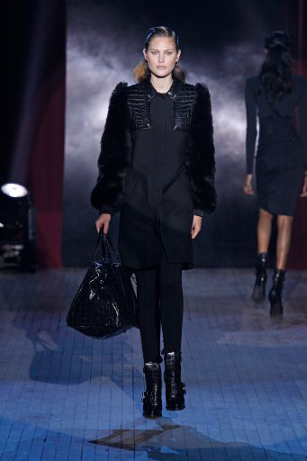
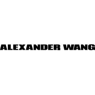

# iDesigner Competition - Fashion

# 2019 Competition
The 2019 competition, sponsored by Hearst, is part of the [FGVC6 workshop](http://fgvc.org) at [CVPR](http://cvpr2019.thecvf.com/).

Please open an issue if you have questions or problems with the dataset.

## Tasks

Designers classification for runway images.

## Kaggle
We are using Kaggle to host the leaderboard. Checkout the competition page here.

## Dates (TBD)
|||
|----|---------------|
Data Released| April 2019|
Submission Server Open | TBD|
Submission Deadline|  TBD|
Winners Announced| June 2019|

Traiing data:
 [Download training data!](https://drive.google.com/open?id=1DIoLZVCCSObPbHcTqGn2E44uJ8_vL9L2)
## Details

For more details on iDesigner 2019, please see our Kaggle page.

