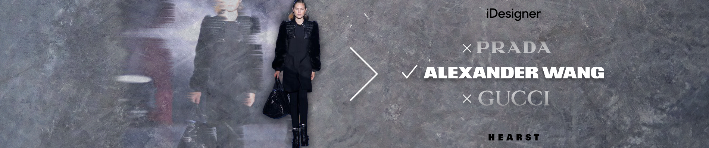
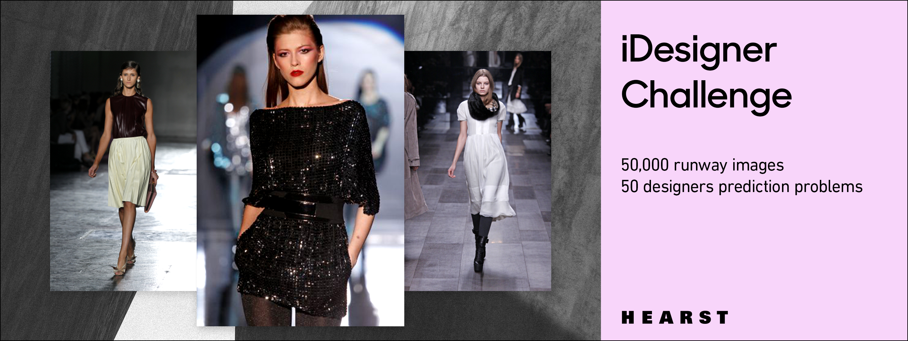

# iDesigner Competition - Fashion

# 2019 Competition
The 2019 competition, sponsored by Hearst, is part of the [FGVC6 workshop](http://fgvc.org) at [CVPR](http://cvpr2019.thecvf.com/).

Please open an issue if you have questions or problems with the dataset.

## Tasks

Designers classification for runway images.

## Kaggle
We are using Kaggle to host the leaderboard. Checkout the competition page [here](https://www.kaggle.com/c/idesigner).

## Dates (TBD)
|||
|----|---------------|
Start Data (Data Released)| April 5, 2019|
Submission Server Open | April 10, 2019|
Submission Deadline|  May 31, 2019|
Winners Announced| June 2019|

## Details

For this competition, we sample 50,000 runway images, including 50 fashion designers from past. The dataset embraces a variety of fashion items: shoes, bags, dress, jackets etc.

For more details on iDesigner 2019, please see our [Kaggle page](https://www.kaggle.com/c/idesigner).

## About Hearst Magazine Media
Hearst Magazine Media Inc. is the leading media company serving the fashion & luxury space, supported by print and digital brands such as Harper's BAZAAR, ELLE, Esquire and Marie Claire. Leveraging data from our 200M unique visitors, on-and-off site click stream data, and our brand advertising partners data, we're building a robust and disruptive capability to serve the fashion & luxury industry with insights to better build their businesses and grow market share.
